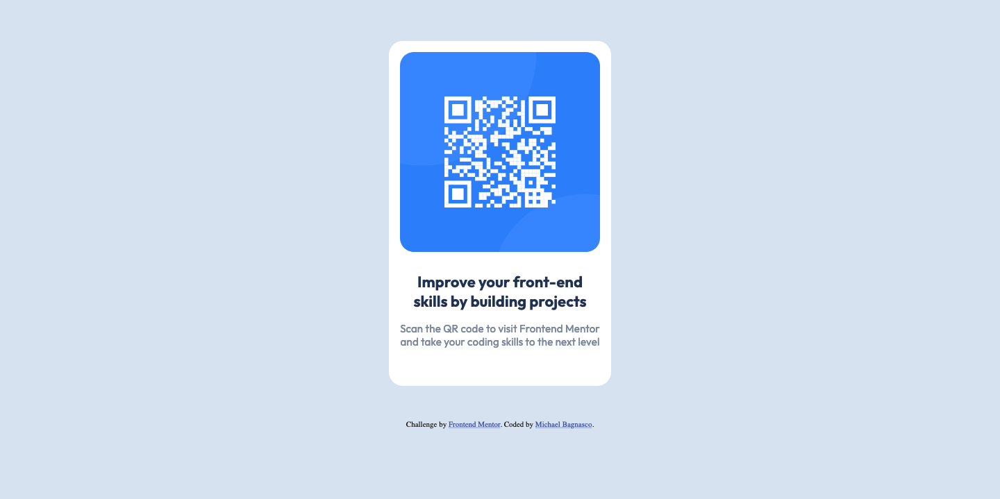

# Frontend Mentor - QR code component solution

This is my solution to the [QR code component challenge on Frontend Mentor](https://www.frontendmentor.io/challenges/qr-code-component-iux_sIO_H). Frontend Mentor challenges help you improve your coding skills by building realistic projects. 

## Table of contents

- [Overview](#overview)
  - [Screenshot](#screenshot)
  - [Links](#links)
- [My process](#my-process)
  - [Built with](#built-with)
  - [What I learned](#what-i-learned)
  - [Useful resources](#useful-resources)
- [Author](#author)

## Overview

### Screenshot

### Links

- Solution URL: [Github](https://github.com/MichaelBagnasco/qr-code-component-main)
- Live Site URL: [Github Pages](https://michaelbagnasco.github.io/qr-code-component-main/)

## My process
  Built the skeleton HTML first and 

### Built with

- Semantic HTML5 markup
- CSS custom properties
- CSS Grid

### What I learned

I'm an angular developer with 4 year experience, and yet I've never actually written a site with just HTML and CSS. It's always been around js frameworks and CSS frameworks. It was a fun challenge because I found myself googling simple basic things like "How to center a div".

One of the biggest challenges I ran into was structuring my CSS classes in a way that didn't repeat, was reusable, and was clean. Starting by building just the HTML and adding CSS afterwards and cleaning as I went helped.

### Useful resources

- [Centering in CSS: The Complete Guide](https://css-tricks.com/centering-css-complete-guide/) - Bookmark this.

## Author

- Website - [Michael Bagnasco](https://github.com/MichaelBagnasco/qr-code-component-main)
- Frontend Mentor - [@MichaelBagnasco](https://www.frontendmentor.io/profile/yourusername)
- Twitter - [@bagnastayy](https://www.twitter.com/bagnastayy)

